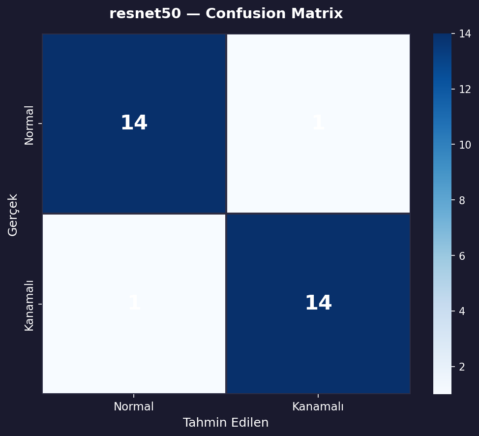
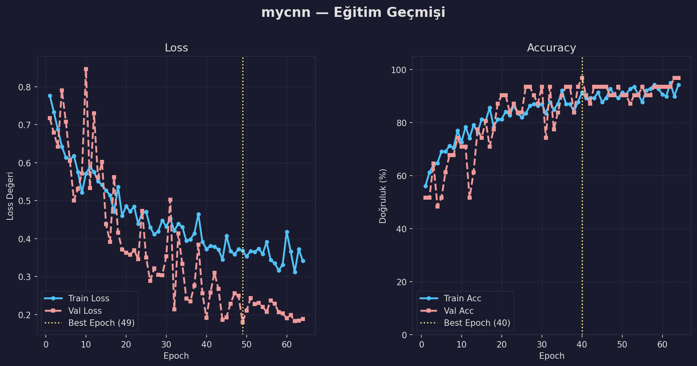

# 🧠 Otonom Beyin Kanaması Teşhis Sistemi (CT)
**Derin Öğrenme, Hiperparametre Optimizasyonu ve Açıklanabilir Yapay Zeka (XAI) Destekli Karar Mekanizması**

---

## 📖 Proje Vizyonu ve Özeti
Bu proje, Bilgisayarlı Tomografi (CT) görüntülerinden beyin kanamasını (Hemorrhage) otomatik olarak tespit etmek için geliştirilmiş bir Derin Öğrenme uygulamasıdır. Klinik teşhis süreçlerinde hız ve güvenilirlik sağlamak amacıyla, hem özel tasarlanmış bir CNN (MyCNN) hem de önceden eğitilmiş ResNet50 modeli kullanılarak karşılaştırmalı bir mühendislik analizi yapılmıştır.

---

## 🌟 Öne Çıkan Özellikler
* 🔄 **Transfer Learning:** ResNet50 mimarisi kullanılarak kanıtlanmış yüksek doğruluk oranlarına ulaşılmıştır.
* 🧠 **Custom CNN:** Parametre sayısı optimize edilmiş, projenin ihtiyaçlarına özel bir evrişimli sinir ağı (MyCNN) geliştirilmiştir.
* ⚙️ **Grid Search:** Hiperparametre optimizasyonu uygulanarak en iyi model konfigürasyonu (öğrenme hızı, ağırlık bozulması vb.) otonom olarak belirlenmiştir.
* 🛡️ **K-Fold Cross Validation:** Modelin genelleme yeteneği 5-katlı çapraz doğrulama ile test edilmiş ve ezberlemenin (overfitting) önüne geçilmiştir.
* 💻 **Gradio Arayüzü:** Kullanıcıların doğrudan medikal görüntü yükleyerek anlık teşhis tahmini alabileceği interaktif bir web arayüzü sunulmuştur.
* 👁️ **Grad-CAM (XAI):** Modelin, sadece sonuç vermekle kalmayıp görüntünün hangi bölgesine odaklanarak karar verdiğini radyologlara gösteren açıklanabilir ısı haritaları entegre edilmiştir.

---

## 📊 Performans ve Metrikler

Modellerin başarısı hem hiperparametre optimizasyonu (Grid Search) hem de genelleme yeteneğini test etmek için 5-Katlı Çapraz Doğrulama (K-Fold) ile değerlendirilmiştir.

### 1. Hiperparametre Optimizasyonu (Grid Search)
*Algoritmanın ulaştığı en verimli eğitim parametreleri:*

| Model | Öğrenme Hızı (LR) | Dropout | Weight Decay | En İyi Val Acc (%) |
| :--- | :---: | :---: | :---: | :---: |
| **ResNet50** | `0.001` | `0.3` | `0.0005` | **%96.77** |
| **MyCNN** | `0.001` | `0.3` | `0.0002` | `%90.32` |

### 2. 5-Katlı Çapraz Doğrulama (K-Fold CV) Sonuçları
*Tüm veri seti üzerinde yapılan çapraz doğrulama sonuçları (Ortalama Değerler):*

| Model | Ortalama Doğruluk (Accuracy) | Ortalama F1-Skoru |
| :--- | :---: | :---: |
| **ResNet50** | **%97.00** | **0.969** |
| **MyCNN** | %94.50 | 0.943 |

*(Not: MyCNN modeli, k-katlı çapraz doğrulamada bazı lokal katmanlarda **%97.5**'e kadar doğruluk sıçramaları göstererek hafif sıklet yapısına rağmen yüksek potansiyel sergilemiştir, ortalamada %94.5 başarıya oturmuştur.)*

---

## 📈 Çıktılar ve Görselleştirme
Aşağıda modellerimize ait karmaşıklık matrisleri ve eğitim seyri yer almaktadır:

  
  

---

## 🛠️ Kullanım ve Kurulum

Sistemi lokal ortamınızda çalıştırmak veya eğitim süreçlerini tekrarlamak için aşağıdaki komutları kullanabilirsiniz:

**1. Interaktif Web Arayüzünü Başlatma (Gradio)**
Eğitilmiş en iyi modellerle anlık tahmin yapmak için:

    python app.py

**2. Otonom Eğitimi Başlatma (K-Fold CV)**
Tüm veri seti ile K-Fold çapraz doğrulama eğitimini sıfırdan başlatmak için:

    python train_kfold.py

**3. Hiperparametre Optimizasyonu (Grid Search)**

    python grid_search_resnet.py  # ResNet50 Optimizasyonu için
    python grid_search.py         # MyCNN Optimizasyonu için

---

## 📁 Dizin Mimarisi (Dosya Yapısı)

    Brain-Hemorrhage-Detection/
    ├── src/                    # Çekirdek veri seti, model mimarileri ve eğitim lojiği
    ├── head_ct/                # Görüntü veri seti (Kaggle)
    ├── outputs/                # Kaydedilen modeller (.pth), grafikler ve sonuçlar
    ├── app.py                  # Gradio web arayüzü uygulaması
    ├── train_kfold.py          # 5-Katlı çapraz doğrulama eğitim betiği
    ├── grid_search.py          # MyCNN hiperparametre optimizasyonu betiği
    └── grid_search_resnet.py   # ResNet50 hiperparametre optimizasyonu betiği

> **⚠️ Feragatname:** > Bu proje akademik amaçlarla ve derin öğrenme tekniklerinin medikal görüntüler üzerindeki etkinliğini test etmek için geliştirilmiştir. Teşhis için her zaman profesyonel tıbbi yardım alınmalıdır.
